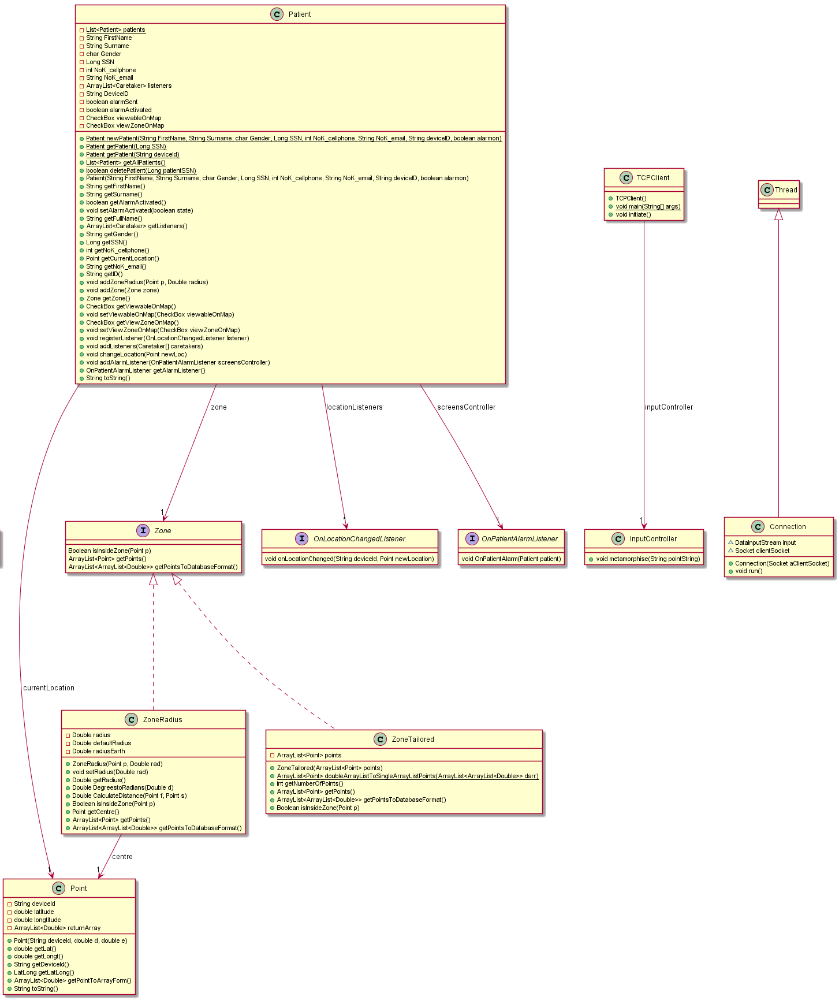

# Documentation for core module

This document provides an overview of the projects core code, supplemented by an UML. The main function of this project module is to
create and handle patients, zones and listeners who wants to be alarmed when patients breach their zone. 

The implementation of core functionality is split into five packages
* **core**: Contains code for handling input and for opening given url on default internet-browser through eclipse
* **datasaving**: Class for establishing connection with the webserver and fetching data as well as passing data to the DB
* **listeners**: Contains interfaces, making it possible for caretakers, ui- and core code to detect change in location
* **participants**: Contains caretaker (used for login) and patient, which contains code for handling patients and their zones
* **zones**: Implements points on map, converting from latlongs, and classes for creating both tailored and circular zones

Note that some changes are still to be made since the TCP-connection is not established yet.

A class diagram of the classes and their associations is provided below.

