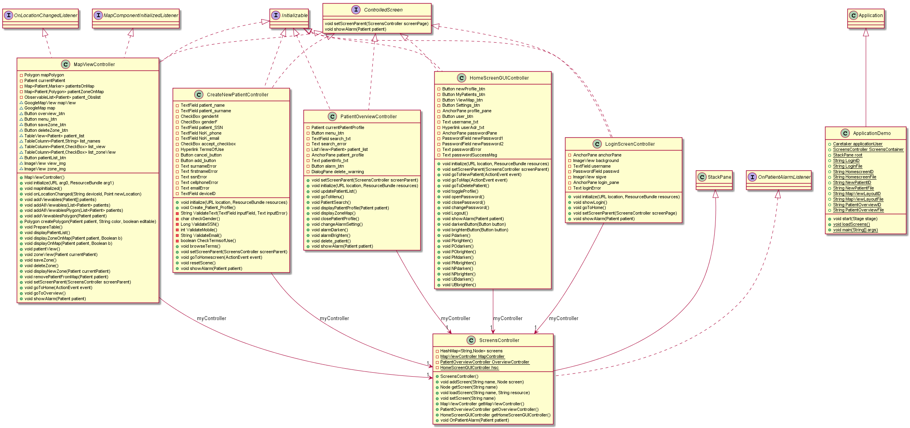

# Documentation for ui module

This document provides an overview of the projects ui code, supplemented by an UML. The main function of this project module is to
provide an extensive graphical unit interface which displays patients location, their zones and editing patients for the service provider (caretaker).

The implementation of ui functionality is contained in one package (app.ui) and consists of the following classes:
* **ApplicationDemo**: Fully functional application demo with generated data.
* **ControlledScreen**: Interface implemented by all fxml-controllers allowing switching between screens. This interface also provides a showAlarm-
method which will display the alarm whenever a zone is breached, no matter what screen the user currently is in.
* **CreateNewPatientController**: Controller handling all functionality connected to creating new patients on the patient overview tab.
* **HomeScreenGUIController**: Displays the homescreen with the four functionalities provided to the serviceprovider.
* **LoginScreenController**: Handles the GUI-elements of the login screen.
* **MapViewController**: Implements mapComponentInitializedListener and OnLocationChangedListener in addition to controlledScreen. This class is in 
addition to controlling the mapview-layout with patients, also responsible for editing patient information being displayed.
* **PatientOverviewController**: Displays an overview over the patients that the current user (service provider) has access to. It is also here one can
edit patients and their zones, even altering between whether the alarm should be turned on or off.
* **ScreensController**: Extends StackPane, making it possible to stack all screens on top off each other, rather than loading the screens every time
the user changes the window.

A class diagram of the classes and their associations is provided below.

